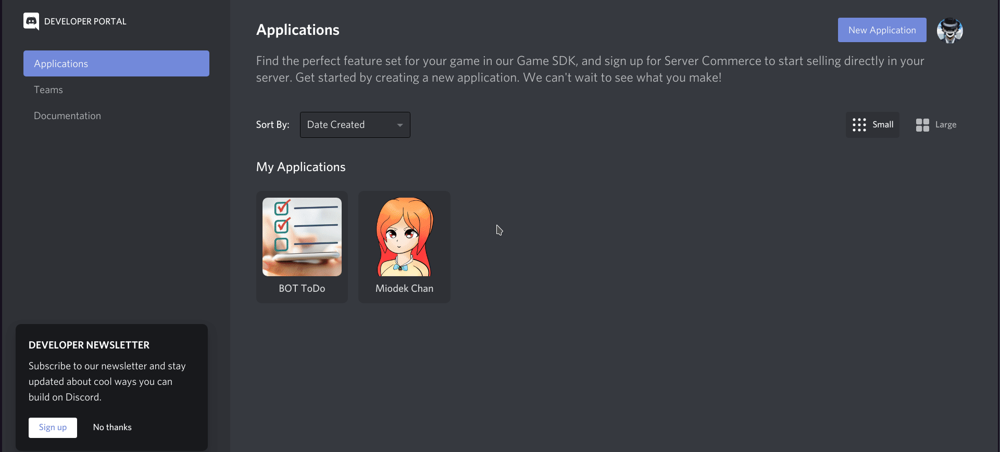
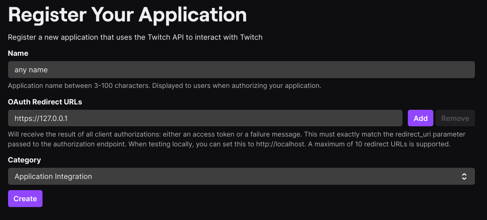
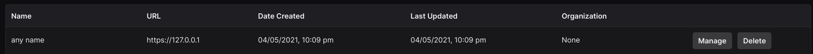
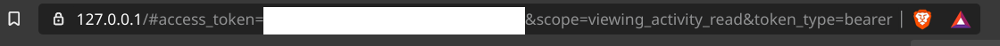

# Miodek-Chan
Miodek-Chan is doscord bot which manages multiple features:
* Checking twitch status and sending reminder message ( was supposed to be primary feature, because other bot wasn't working properly )
* User role saving and returning when users leaves server and comes back
* Role punishment ( saving and deleting user roles and giving them punishment role which reduces ammount of channels that user could see )
* Managing youtube music querry and playing it on voice channel
* sending message about streaming info when specified words are included in message
* welcoming users on server by sending a message
* sending messages via http requests

This bot is written in half-polish (requested by polish streamer), so sometimes bot sends polish messages. If you are interested in translation fell, free to open an issue or contribute
## Instalation
 Miodek-Chan is written in javascript (now typescript, bu it is simmilar) which requires you to have latest node.js installed on the hosting server
### Setting discord bot
Miodek-Chan is configured to work for everybody even, when other people use the same code
1. Firstly, we need to register our bot on 
[discord developers](https://discord.com/developers/applications)
as new application ang get our bot token


2. Secondly, we need to add this bot onto our server:


---

### Twitch integration
1. To get application id you need to register app on
[twitch apps](https://dev.twitch.tv/console/apps/create):

Have in mind that to create app you need to have set up Two-Factor Authentication on your twitch account. 
After that you will be redirected to managment page where you will see all of your applications. Click your bot app
[Manage](https://dev.twitch.tv/console/apps)
button and at the bottom your twitch client id should be displayed


2. Getting oauth2 token requires you some redirects. Firstly you need to folow to: 
 https://id.twitch.tv/oauth2/authorize?response_type=token&client_id=client_id&redirect_uri=http://localhost&scope=viewing_activity_read. where you need to paste your `client_id` in this url. After that, you will be asked to authorize. Then you will be redirected to unexisting site, where in url you will get your oauth token.
 
 When you will have both, you will get access to your channel data. Get your channel id by goint to this url:
 https://api.twitch.tv/kraken/channel?client_id=client_id&token=_token&api_version=5
 Of course replace `client_id` and `_token`.
 Small json will pop up, where property `_id` is your channel id

---

### Youtube music integration
`Work in progress`

---


### Setting up server
You will have to host your bot on some some kind of server. You can either pay monthly subscription for
[vps](https://en.wikipedia.org/wiki/Virtual_private_server)
or set up you own server on one of your computers. The best option would be 
[raspberry pi](https://www.raspberrypi.org/)
because it's relatively good computer for a cheep price.

#### Linux
Clone Repository onto your computer and cd to it:
```bash
git clone https://github.com/DavePlayer/miodek_bot.git && cd miodek_bot
```
Create .env file and fill config variabless
```bash 
touch .env
```
```.env
# .env configs
TOKEN='discord bot token'

#Discord necessary ids
DISCORD_CHANNEL='discord server main informational channel id'
DISCORD_WELCOME_CHANNEL='discord channel id for welcoming users'
DISCORD_COMMAND_CHANNEL='discord channel id for bot commands'
DISCORD_MAIN_CHANNEL='discord channel id for main conversations (used for sending custom messages vai http)'
DISCORD_SERVER_ID='discord server id'

# Twitch integration
TWITCH_CHANNEL_ID=discord_channel_id_for_reminding_users_about_streams
TWITCH_CLIENT_ID='twitch client id from oauth' # getting from twitch api(pain in the ass)
TWITCH_TOKEN='twitch oauth token'
TWITCH_USERNAME='twitch streamer username'

# Punishment Roles
PUNISHMENT_ROLE='punishment role name'

# http server settings
PORT='custom port for http server'

# YT music integration
YTAPIKEY='youtube api key for getting yt films info'

# rest (not sure hot to name it)
STATUS='custom bot status'
REMINDER_MESSAGE="Json format string for reminding users when are the streams"

#custom REMINDER_MESSAGE example
# "\n{\n    "message": "read twitch stream info baka!",\n    "live list": {\n      "Monday": "19:00",\n        "Tuesdey": "19:00",\n        "Wendsday": "19:00",\n        "Thursday": "19:00",\n        "Friday": "19:00",\n\n        "Saturday": "19:00",\n        "Sunday": "Wolne lub gra z subami"\n    }\n}"

```
It is also required to create necessary files to save data:
```bash
touch punishedUsers.json
touch roles.json
touch usedMessages.json
```
and fill them with proper brackets:
```bash
echo "[]" > punishedUsers.json
echo "{\"users\": [], \"roles\": []}" > roles.json
echo "[]" > usedMessages.json
```

The last thing to do is downloading necessary packeges and runing bot:
```bash
npm install

npm start
```

During that time you can setup miodek-chan as linux service by creating service file: `/etc/systemd/system/miodek.service` (before starting service run `npm start` or `npm build` to build javascript files in out dir):
```
[Unit]
Description=Miodek-Chan bot for discord server
After=network-online.target

[Service]
Restart=on-failure
StandardOutput=syslog               # Output to syslog
StandardError=syslog                # Output to syslog
SyslogIdentifier=miodek_bot
WorkingDirectory=/path/to/cloned/repo/miodek_bot/
ExecStart=/usr/bin/node /path/to/cloned/repo/miodek_bot/out/index.js

# limit CPU and RAM quota for our service
# Not necessary, but i am running other servers, so i need it
CPUAccounting=true
CPUQuota=60%                        
MemoryAccounting=true
MemoryLimit=500M

[Install]
WantedBy=multi-user.target
```
To check your bot server status just type:
```bash
systemctl status miodek.service

● miodek.service - Miodek-Chan bot for discord server
   Loaded: loaded (/etc/systemd/system/miodek.service; enabled; vendor preset: enabled)
   Active: active (running) since Mon 1981-04-05 23:15:47 CEST; 69min ago
 Main PID: 18373 (node)
    Tasks: 11 (limit: 2062)
      CPU: 4.275s
   CGroup: /system.slice/miodek.service
           └─18373 /usr/bin/node /path/to/cloned/repo/miodek_bot/out/index.js
```
If it's active and runing, you set up most of the things properly (might get error later on if you didn't provide proper configs)


